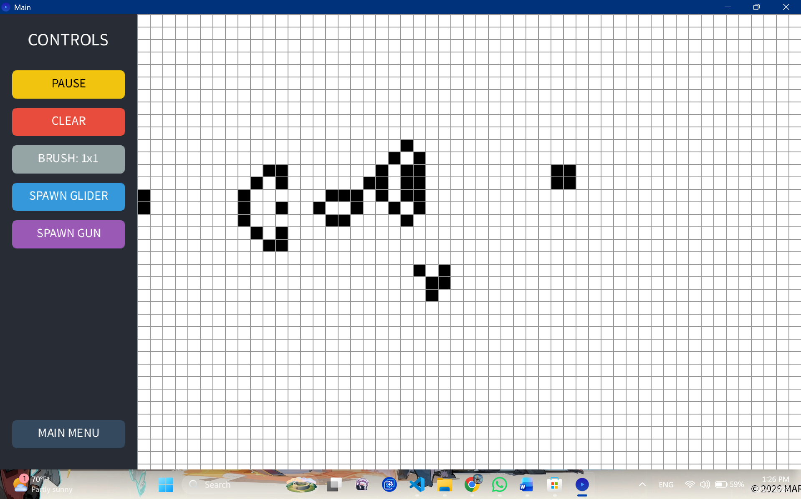

# Conway's Game of Life: Java Interactive Engine

## Overview
This project is a high-performance, object-oriented implementation of John Horton Conway's **Game of Life**, built from scratch in Java using the Processing graphics library. It features a fully interactive Graphical User Interface (GUI), an educational theory section, and an optimized mathematical engine for simulating cellular automata.

## 🌟 Key Features
* **Interactive Simulation:** Paint cells with a variable brush size (1x1 or 3x3), pause/play the simulation, and clear the board on the fly.
* **Instant Shape Spawners:** Built-in buttons to instantly spawn a traveling Glider or a massive 36-cell **Gosper Glider Gun**.
* **Finite State Machine:** Seamless navigation between a "Living" Main Menu, an Encyclopedia/Theory screen, and the active Simulation grid.
* **Double-Buffer Rendering:** Uses a temporary memory grid to calculate future generations simultaneously, preventing visual tearing and mathematical errors.
* **Smart Frame Pacing:** The UI and mouse inputs run at a smooth 60 Frames Per Second (FPS), while the simulation math is paced using modulo arithmetic to a readable 12 FPS.

## 📂 Project Structure
The code is strictly modular and follows Object-Oriented Programming (OOP) principles:
* `Main.java`: The master controller. Manages the window setup, the State Machine, frame pacing, and hardware inputs (mouse clicks and drags).
* `Grid.java`: The physics engine. Manages the 2D array, calculates the Moore neighborhood (8 surrounding cells), and applies the survival rules.
* `Cell.java`: The foundational data object representing a single living or dead unit.
* `BackgroundScreen.java`: The educational UI module that renders the theory, rules, and visual examples of cellular patterns.

## 🧠 The 4 Rules of Life
The entire simulation runs on four simple mathematical rules:
1. **Underpopulation:** A live cell with fewer than 2 live neighbors dies.
2. **Survival:** A live cell with 2 or 3 live neighbors lives on.
3. **Overpopulation:** A live cell with more than 3 live neighbors dies.
4. **Reproduction:** A dead cell with exactly 3 live neighbors becomes alive.

## 🚀 How to Compile and Run
This project uses the `core-4.5.2.jar` Processing library for hardware-accelerated rendering. You must compile and run it with this library linked. Open your terminal in the project folder and run the following commands:

**1. Compile the code:**
*(Note: `-encoding UTF-8` ensures the modern UI text symbols compile correctly in Windows terminals).*
```bash
javac -encoding UTF-8 -cp ".;core-4.5.2.jar" Cell.java Grid.java BackgroundScreen.java Main.java
